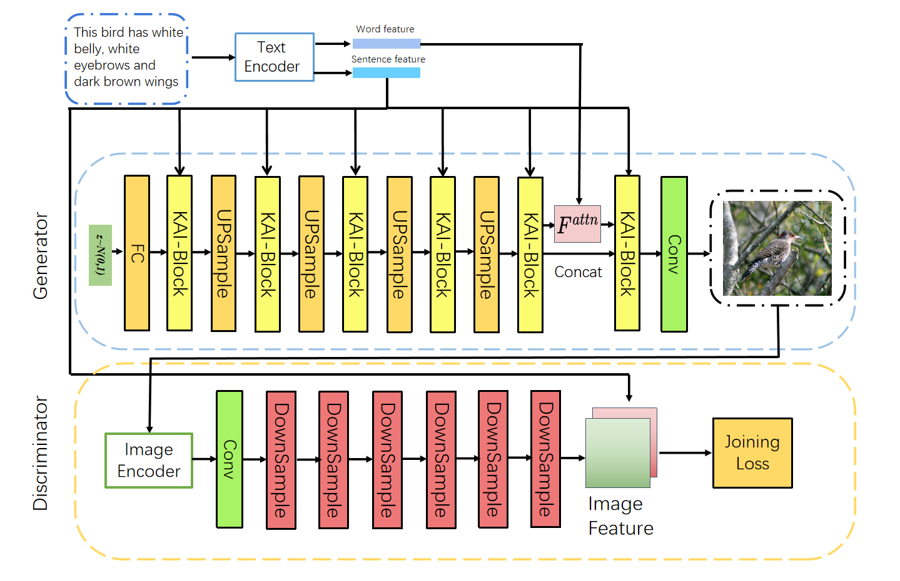
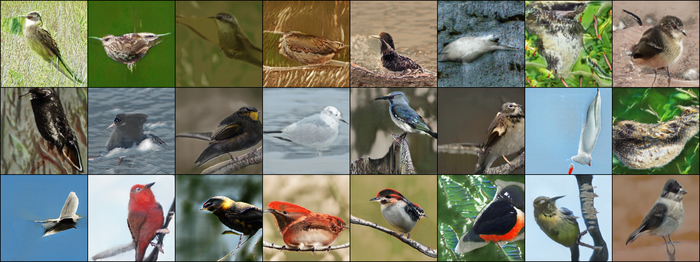
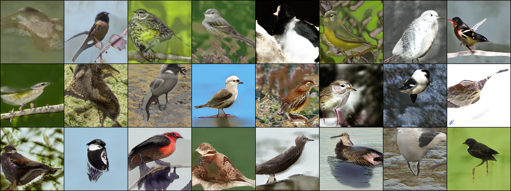
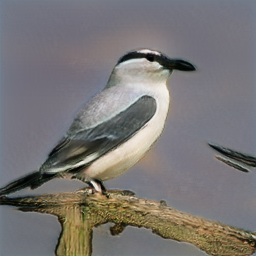
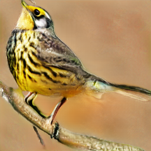
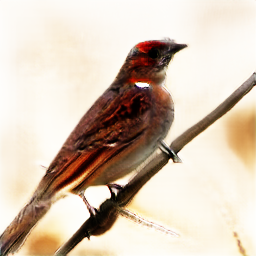
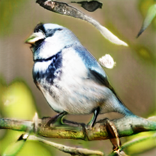
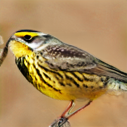

# AccAttnGAN
### The whole structure
Paper is available on https://arxiv.org/abs/2306.14708
## Requirements
- python 3.8.0
- Pytorch 1.8.0
- Pandas 1.2.2
- tqdm 4.62.3
- torchvision 0.9.0
- Pillow 7.2.0
- matplotlib 3.3.4
- At least 1x6GB NVIDIA GPU

## Preparation
### Datasets
1. Download the preprocessed metadata for [birds](https://drive.google.com/file/d/1I6ybkR7L64K8hZOraEZDuHh0cCJw5OUj/view?usp=sharing) [coco](https://drive.google.com/file/d/15Fw-gErCEArOFykW3YTnLKpRcPgI_3AB/view?usp=sharing) and extract them to `data/`
2. Download the [birds](http://www.vision.caltech.edu/visipedia/CUB-200-2011.html) image data. Extract them to `data/birds/`
3. Download [coco2014](http://cocodataset.org/#download) dataset and extract the images to `data/coco/images/`

## Pretrained Model
- [DF-GAN for bird] It is in  '/gen_weights', There are three pth file in it.
- [Text encoder for bird and coco] It is in '../text_encoder_weights/text_encoder200.pth'

## Training
  ```
  cd src/
  ```
### Train the model
  -  `python train_segan.py`

## Evaluation
  ```
  cd src/
  ```
### Input the sentence in the model 
  -  `python eval_example.py`


  
### compute IS and FID
  -  `python metrics_evaluation.py`

##Tips
 - We can slightly increase the learning rate and get the better result. 
 - Generator's LR ~ (0.0001,0.0004)
 - Discriminator's LR ~ (0.0003,0.0012)
 - Do not use sgd, adam is better.


# Image in Epoch 330


   Random images in training process
  
   300<=Epoch<=500, Image is better.

## Some perfect images


